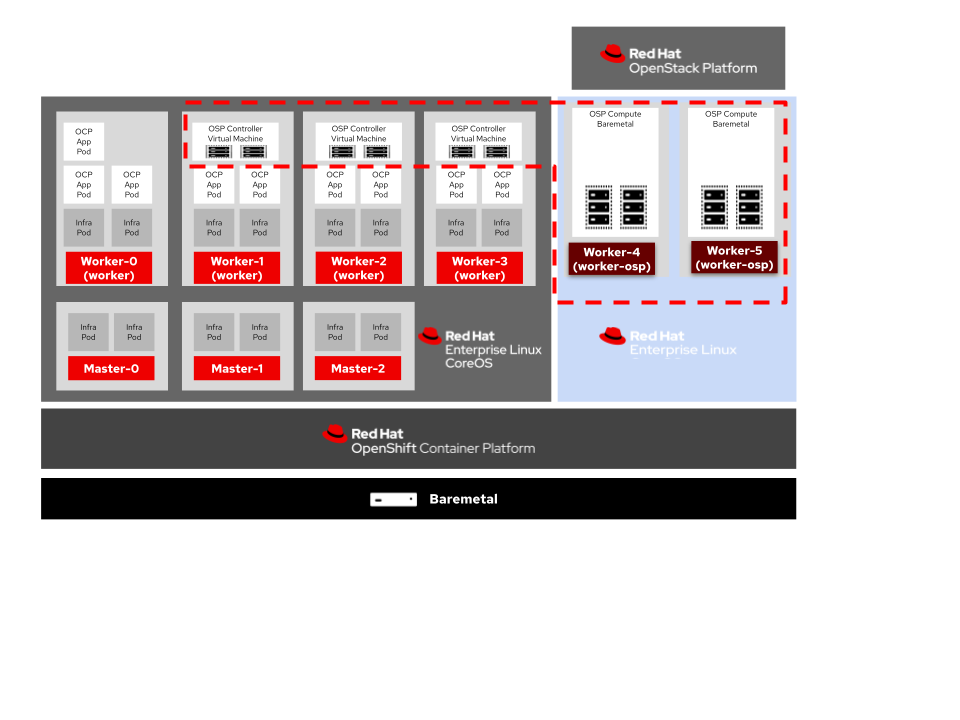
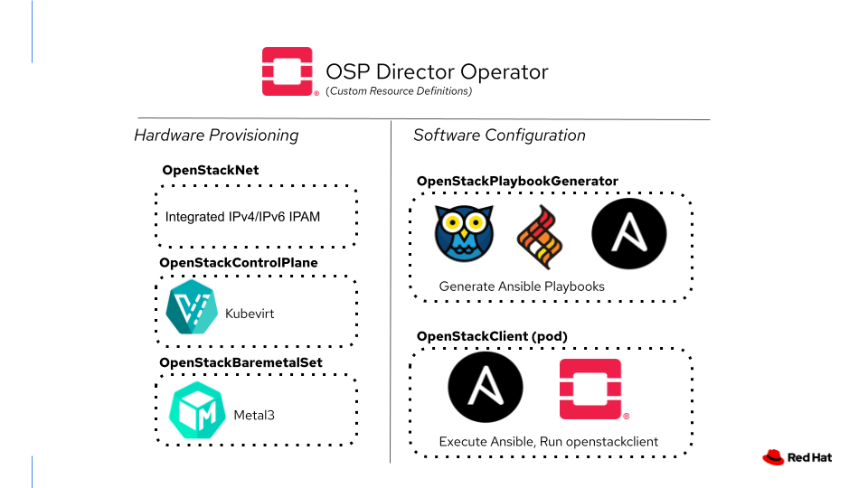

OSP Director Operator Architecture
==================================

Architecture:
-------------
This shows the OSP architecure that we currently support from a high level. The Controllers are hosted as VMs on OpenShift Virtualization/Kubevirt. Baremetal Hosts are used for OSP Computes.

The Undercloud implemented via OpenShift, and OpenStack is deployed via a pod.

Custom Resource Definitions (CRDs)
----------------------------------
The OSP Director Operator creates a set of Custom Resource Defitions on top of OpenShift to manage resources normally created by the TripleO's Undercloud. These CRDs are split into two types for hardware provisioning and software configuration.

The left side of this diagram describes our hardware provisioning CRDs including OpenStackNet, OpenStackControlPlane, and OpenStackBaremetalSet. These CRDs will allow administrators to provision and scale out virtual and baremetal hardware for an OSP deployment. Virtual machines for the OSP control plane are provisioned via Kubevirt(OpenShift Virtualization). Baremetal for OSP compute hosts is provisioned via Metal3. And OpenStackNet provides a simple IPAM solution for IPv4 and IPv6 static IP assignments.

The right side of the diagram represents software configuration for the OpenStack deployment. Ansible playbooks are generated via the OpenStackPlaybookGenerator resource. These are stored in a Git repository and a simple tripleo-deploy.sh script allows administrators to manage and deploy the generated playbooks from the 'openstackclient' pod. The OSP Director Operator takes care of generated the required Heat environment files for the TripleO software deployment. Administrators can provide their own settings and customizations via ConfigMaps.
